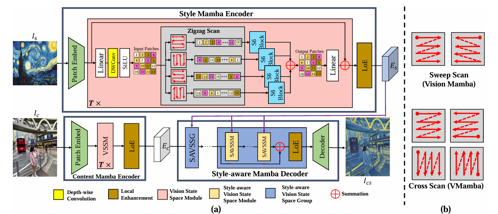
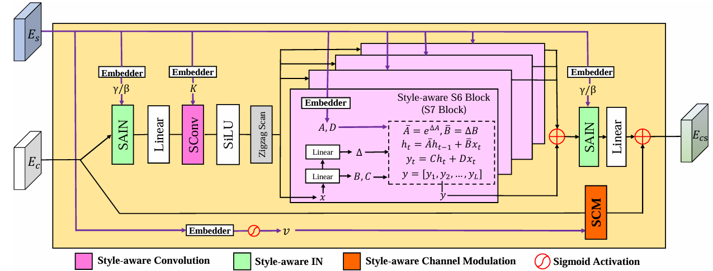

# [CVPR 2025 Highlight] SaMam: Style-aware State Space Model for Arbitrary Image Style Transfer

Pytorch implementation of our CVPR 2025 highlight paper ***SaMam: Style-aware State Space Model for Arbitrary Image Style Transfer***.

## Introduction

**TL;DL:** We introduce a Mamba backbone for arbitrary image style transfer, which strikes a balance between generation quality and efficiency.


Global effective receptive field plays a crucial role for image style transfer (ST) to obtain high-quality stylized results. However, existing ST backbones (e.g., CNNs and Transformers) suffer huge computational complexity to achieve global receptive fields. Recently, State Space Model (SSM), especially the improved variant Mamba, has shown great potential for long-range dependency modeling with linear complexity, which offers an approach to resolve the above dilemma. In this paper, we develop a Mamba-based style transfer framework, termed SaMam. Specifically, a mamba encoder is designed to efficiently extract content and style information. In addition, a style-aware mamba decoder is developed to flexibly adapt to various styles. {Moreover, to address the problems of local pixel forgetting, channel redundancy and spatial discontinuity of existing SSMs, we introduce local enhancement and zigzag scan mechanisms.} Qualitative and quantitative results demonstrate that our SaMam outperforms state-of-the-art methods in terms of both accuracy and efficiency.



*(a) An overview of our SaMam framework; (b) An illustration of the selective scan methods in Vision mamba and VMamba.*



*The detailed architecture of Style-aware Vision State Space Module (SAVSSM).*


## Dependencies

- python=3.10.4
- torch=2.3.0
- torchvision=0.18.1
- pytorch-lightning=2.3.0
- trion=2.3.1
- causal-conv1d=1.4.0
- mamba-ssm=2.2.2
- cuda=12.6 (>=12.0)


## Dataset Preparation

We use [wikiart](https://www.kaggle.com/competitions/painter-by-numbers/data) as our style dataset and [MS_COCO](https://cocodataset.org/#download) as our content dataset. Furthermore, the folder structure should be like:

```
Dataset
├── wikiart
│   ├── 0000001.jpg
│   ├── 0000002.jpg
│   ├── 0000003.jpg
│   ├── ...
├── MS_COCO
│   ├── 000001.jpg
│   ├── 000002.jpg
│   ├── 000003.jpg
│   ├── ...
├── test_data
│   ├── content
│   │   ├── c1.jpg
│   │   ├── c2.jpg
│   │   ├── ...
│   ├── style
│   │   ├── s1.jpg
│   │   ├── s2.jpg
│   │   ├── ...
```


## Train

Download [pretrained VGG](https://drive.google.com/file/d/13BzdootYTuwCiV4VW0sjSxjopWJiiRZg/view?usp=drive_link), and put the VGG checkpoint (.pth) into folder "./LOSS/vgg_ckp/". Then you can get into training folder "./TRAIN/":

```
cd ./TRAIN/
```

All the training settings are provided in function "parse_args()" of the file "train_SaMam.py". You can adapt them manually.

:blush:**Training on mamba_ssm:** (default)

If your device is equipped with [mamba_ssm](https://github.com/Dao-AILab/causal-conv1d/releases) and [causal-conv1d](https://github.com/Dao-AILab/causal-conv1d/releases), you can train our SaMam to strike a fast convergence. With the default setting in "train_SaMam.py", you can train a SaMam model. Run:

```
python train_SaMam.py --content [train_content_dataset_folder] --style [train_style_dataset_folder]
```

:worried:**Training on pure torch:**

If you just use windows platform or the device can not be equipped with mamba_ssm, you can train our SaMam with only torch. However, the convergence speed is **very very very slow**! You should specify hyper-parameter **"mamba-from-trion" to 0**. Run:

```
python train_SaMam.py --content [train_content_dataset_folder] --style [train_style_dataset_folder] --mamba-from-trion 0
```

## Test

Please get into test folder "./TEST/".

```
cd ./TEST/
```

All the test settings are provided in function "parse_args()" of the file "test_image.py". You can adapt them manually.


:blush:**Test on mamba_ssm:** (default)

If your device is equipped with [mamba_ssm](https://github.com/Dao-AILab/causal-conv1d/releases) and [causal-conv1d](https://github.com/Dao-AILab/causal-conv1d/releases), you can test our SaMam with quick inference.

```
python test_image.py --content-dir [your_test_content_folder] --style-dir [your_test_style_folder] --model_ckpt [SaMam_ckpt_path]
```

For instance, a command sample is "python test_image.py --content-dir ./test_images/content/ --style-dir ./test_images/style/ --model_ckpt ./checkpoint/iteration_200000.ckpt"

:worried:**Test on pure torch:**

If you are a windows platform player or don't install mamba_ssm, you can also generate stylized results by pure torch. You should also specify hyper-parameter **"mamba-from-trion" to 0**. Run:

```
python test_image.py --content-dir [your_test_content_folder] --style-dir [your_test_style_folder] --mamba-from-trion 0 --model_ckpt [SaMam_ckpt_path]
```

## Citation

If you find our work useful in your research, please cite our [paper](https://arxiv.org/pdf/2503.15934)~ Thank you!

```
@article{liu2025samam,
  title={SaMam: Style-aware State Space Model for Arbitrary Image Style Transfer},
  author={Liu, Hongda and Wang, Longguang and Zhang, Ye and Yu, Ziru and Guo, Yulan},
  journal={arXiv preprint arXiv:2503.15934},
  year={2025}
}
```

## Acknowledgement

This repository is heavily built upon the amazing works [AdaConv](https://github.com/RElbers/ada-conv-pytorch) and [StyTR-2](https://github.com/diyiiyiii/StyTR-2). Thanks for their great effort.

## Contact

[Hongda Liu](mailto:2946428816@qq.com)
